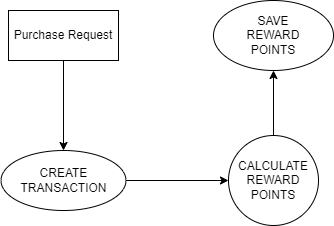
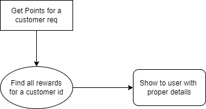

## RewardSystem

This is a springboot based service which contains functionality of creating a purchase and for every transaction calculate and award points to customer.

### Technology used
+ Java 17
+ Gradle 8.7
+ Springboot v 3.3.2
+ Postgresql 16

### Flow Diagram
#### Create Reward Point Flow


#### Get Reward Point Flow


### API Endpoints

#### Purchase
+ URI: "api/txn/createTransaction"
+ Method: POST
+ Function: Process one transaction for a customer
+ Req Body:
```json
{
    "customerId": "123e4567-e89b-12d3-a456-426614174000",
    "amount": 120
}
```
+ Response:
```
Transaction processed and rewards awarded
```

#### Bulk Purchase
+ URI: "api/txn/createBulkTransaction"
+ Method: POST
+ Process multiple transaction for a customer
+ Req Body:
```json
{
  "customerId": "123e4567-e89b-12d3-a456-426614174002",
  "transactions":[
    {
      "amount":130,
      "transactionDate":"2024-04-12"
    },
    {
      "amount":140,
      "transactionDate":"2024-07-12"
    },
    {
      "amount":150,
      "transactionDate":"2024-08-03"
    }
  ]
}
```
+ Response:
```json
[
  {
    "id": "5b75b2b1-cc97-426a-9e32-94f00c5e60ff",
    "customer": {
      "id": "123e4567-e89b-12d3-a456-426614174002",
      "name": "Alice Johnson",
      "email": "alice.johnson@example.com",
      "phoneNumber": "555-8765"
    },
    "amount": 130,
    "transactionDate": "2024-04-12T10:00:00"
  },
  {
    "id": "de5cb005-d7e4-4caf-a97f-639533061e73",
    "customer": {
      "id": "123e4567-e89b-12d3-a456-426614174002",
      "name": "Alice Johnson",
      "email": "alice.johnson@example.com",
      "phoneNumber": "555-8765"
    },
    "amount": 140,
    "transactionDate": "2024-07-12T10:00:00"
  },
  {
    "id": "21bb243f-0e94-441c-9b5f-c026426644d5",
    "customer": {
      "id": "123e4567-e89b-12d3-a456-426614174002",
      "name": "Alice Johnson",
      "email": "alice.johnson@example.com",
      "phoneNumber": "555-8765"
    },
    "amount": 150,
    "transactionDate": "2024-08-03T10:00:00"
  }
]
```

#### Show Points
+ URI: "api/reward/customer/[customerId]?months=2"
+ ** In uri request parameter 'months' is optional. default value is 3 **
+ Method: GET
+ Function: It gives the rewards for a customer for time specified in months(if not specified, 3)
+ Response:
```json
{
  "customer": {
    "id": "123e4567-e89b-12d3-a456-426614174000",
    "name": "John Doe",
    "email": "john.doe@example.com",
    "phoneNumber": "555-1234"
  },
  "totalPoints": 330,
  "rewards": [
    {
      "transactionId": "0c3f963f-1169-4980-9034-fdca7de73ee0",
      "transactionAmount": 150.00,
      "points": 150,
      "awardedDate": "2024-08-01T16:31:35.573555"
    },
    {
      "transactionId": "a6464c93-d665-4701-831b-d86bf57c1849",
      "transactionAmount": 120.00,
      "points": 90,
      "awardedDate": "2024-08-01T16:35:22.170311"
    },
    {
      "transactionId": "c66a127d-3e13-4b67-8574-b166f1aa327c",
      "transactionAmount": 120.50,
      "points": 90,
      "awardedDate": "2024-08-01T20:20:14.986162"
    },
    {
      "transactionId": "592d1ba4-ccde-4533-99fc-f86b466fbe0c",
      "transactionAmount": 12.00,
      "points": 0,
      "awardedDate": "2024-08-02T13:00:46.199788"
    }
  ]
}
```

### More evidence in 'Evidence' folder
